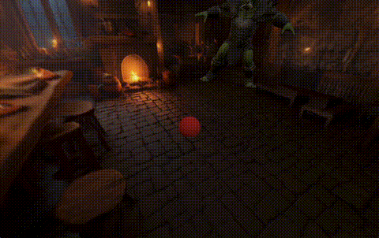

# Interactive Tavern Demo

### Try it out @ https://spark-physics.netlify.app



A showcase of [**Spark**](https://sparkjs.dev/) (Gaussian Splats) + **Rapier Physics** + **Three.js** integration, demonstrating how to combine splat rendering with a collider mesh for simple physics.

This demo serves as an example of:
- Integrating Gaussian splat rendering with traditional 3D graphics
- Setting up physics simulation with mesh colliders
- Creating interactive audio systems with Web Audio API
- Implementing character animation with physics-based interactions

## 🌟 Features

* **Gaussian Splat Rendering**: Splat scene rendering using Spark library
* **Physics Simulation**: Realistic projectile physics and collision detection with Rapier
* **Animated Characters**: Character meshes with bone-level collision detection
* **Spatial Audio**: Distance-based volume and velocity-based pitch modulation
* **Debug Visualization**: Toggle between splat rendering and collision mesh wireframes
* **First-Person Controls**: Smooth pointer-lock movement with WASD + mouse look

## 🎮 Controls

* **Click**: Enter first-person mode / Shoot projectiles
* **WASD**: Move around the tavern
* **R/F**: Fly up and down
* **Space**: Toggle debug mode (collision mesh vs. splat rendering)


## Getting started

```bash
# Install dependencies
npm install

# Start dev server on http://localhost:5173
npm run dev
```

Build for production:

```bash
npm run build
npm run preview    # locally preview production build
``` 